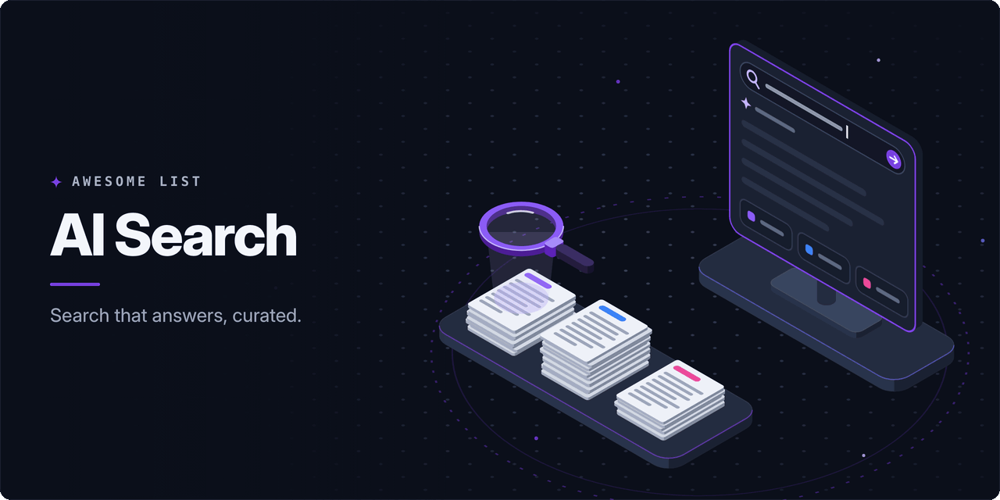

<!-- awesome:hero --><!-- /awesome:hero -->

<!-- awesome:title --><h1 align="center">Awesome AI Search</h1><!-- /awesome:title -->

<!-- awesome:tagline -->Answer engines, search APIs built for AI agents, open-source answer engines, deep research tools and AI search visibility tools.<!-- /awesome:tagline -->

<!-- awesome:badges -->

  
  
  

<!-- /awesome:badges -->

AI search answers a question in words, with sources, instead of handing back a page of links, and a new class of search APIs serves the agents that do the answering. This list covers hosted and open-source answer engines, search APIs and MCP servers for agents, deep research tools, the benchmarks that measure them, and the tools that track how brands show up in AI answers.

## Contents

- [Answer engines](#answer-engines)
- [Search APIs for agents](#search-apis-for-agents)
- [Model web search tools](#model-web-search-tools)
- [Search MCP servers](#search-mcp-servers)
- [Open-source answer engines](#open-source-answer-engines)
- [Deep research](#deep-research)
  - [Hosted deep research](#hosted-deep-research)
  - [Open-source deep research agents](#open-source-deep-research-agents)
  - [Training search agents](#training-search-agents)
- [AI search visibility](#ai-search-visibility)
  - [Visibility trackers](#visibility-trackers)
  - [Open-source and free tools](#open-source-and-free-tools)
  - [Search engine reports and controls](#search-engine-reports-and-controls)
- [Benchmarks](#benchmarks)
- [Guides and research](#guides-and-research)
- [Related lists](#related-lists)
- [Contributing](#contributing)

## Answer engines

- [Andi](https://andisearch.com/) - Search assistant that answers questions in plain language instead of a list of links.
- [Ask Brave](https://search.brave.com/ask) - Brave Search mode that answers questions in chat from Brave's own web index.
- [ChatGPT search](https://openai.com/index/introducing-chatgpt-search/) - Web search inside ChatGPT that answers with links to the sources it used.
- [Consensus](https://consensus.app/) - Answer engine that searches peer-reviewed papers and sums up what the studies find.
- [Elicit](https://elicit.com/) - Research assistant that finds papers, pulls data out of them and summarizes findings.
- [Felo](https://felo.ai/search) - Multilingual AI search that answers across languages and turns results into slides or docs.
- [Google AI Mode](https://search.google/ways-to-search/ai-mode/) - Google Search mode that answers complex questions in a conversation with links.
- [Google AI Overviews](https://search.google/ways-to-search/ai-overviews/) - AI summary shown above Google results, with links to the pages it drew on.
- [Kagi Assistant](https://help.kagi.com/kagi/ai/assistant.html) - Kagi feature that pairs Kagi Search results with a choice of leading models.
- [Komo](https://komo.ai/) - AI search engine that searches the web and answers with sources.
- [Liner](https://liner.com/) - AI search for research that answers from academic and web sources with citations.
- [MediSearch](https://medisearch.io/) - Answer engine for medical questions that draws on the scientific literature.
- [Microsoft Copilot Search](https://www.bing.com/copilotsearch) - Bing mode that answers with a generated summary and the links behind it.
- [Perplexity](https://www.perplexity.ai/) - Answer engine that searches the web and replies with numbered citations.
- [Phind](https://www.phind.com/) - Answer engine for developers that replies with code and visual explanations.
- [Scite](https://scite.ai/) - Research assistant that answers from papers and shows how each one is cited.
- [Undermind](https://www.undermind.ai/) - Literature search agent that reads full papers to find the ones that match a question.
- [You.com](https://you.com/) - AI search and assistant with web-grounded answers and research modes.

## Search APIs for agents

- [Brave Search API](https://brave.com/search/api/) - Web search API on Brave's independent index, with an endpoint for grounding LLM answers.
- [Exa](https://exa.ai/) - Search API with neural retrieval, page contents and deep search for AI apps.
- [Firecrawl Search](https://docs.firecrawl.dev/features/search) - Firecrawl endpoint that searches the web and returns each result as clean markdown.
- [Jina Reader](https://jina.ai/reader/) - URL-prefix API that turns any page into LLM-ready text and runs web searches the same way.
- [Kagi FastGPT API](https://help.kagi.com/kagi/api/fastgpt.html) - API that answers a query with an LLM summary of Kagi Search results.
- [Linkup](https://www.linkup.so/) - Web search API for AI apps that returns sourced answers or raw results.
- [Ollama web search](https://docs.ollama.com/capabilities/web-search) - Ollama API and tool that gives local and cloud models live web results.
- [Parallel](https://parallel.ai/) - Search, extract and research APIs built for AI agents.
- [Perplexity API](https://docs.perplexity.ai/docs/getting-started/overview) - Developer API for Perplexity's web-grounded answer models and agents.
- [Perplexity Search API](https://docs.perplexity.ai/docs/search/quickstart) - Ranked web results from Perplexity's index, for agents that write their own answers.
- [Tavily](https://www.tavily.com/) - Search, extract and crawl API built for LLM agents and RAG pipelines.
- [Valyu](https://www.valyu.ai/) - Search API over web, academic, financial and licensed sources for AI agents.
- [You.com API](https://you.com/docs/welcome) - You.com search, news and research APIs for grounding LLM apps.

## Model web search tools

- [Claude web search tool](https://platform.claude.com/docs/en/agents-and-tools/tool-use/web-search-tool) - Server tool that lets Claude search the web and cite the results in its reply.
- [Gemini grounding with Google Search](https://ai.google.dev/gemini-api/docs/google-search) - Gemini API tool that grounds answers in Google Search results, with citations.
- [Grounding with Bing Search](https://learn.microsoft.com/en-us/azure/ai-foundry/agents/how-to/tools/bing-grounding) - Azure AI Foundry agent tool that grounds replies in live Bing results.
- [Mistral web search](https://docs.mistral.ai/studio/agents/agent-tools/websearch) - Built-in tool that lets Mistral agents search the web.
- [OpenAI web search tool](https://developers.openai.com/api/docs/guides/tools-web-search) - Responses API tool that lets OpenAI models search the web and cite sources.
- [OpenRouter web search](https://openrouter.ai/docs/guides/features/plugins/web-search) - OpenRouter plugin that adds web results to a request for any model.
- [xAI web search](https://docs.x.ai/developers/tools/web-search) - Server-side tool that lets Grok models search the web while they answer.

## Search MCP servers

- [Brave Search MCP Server](https://github.com/brave/brave-search-mcp-server) - Brave's MCP server for web, news, image and local search.
- [DuckDuckGo MCP Server](https://github.com/nickclyde/duckduckgo-mcp-server) - MCP server that searches DuckDuckGo and fetches pages with no API key.
- [Exa MCP Server](https://github.com/exa-labs/exa-mcp-server) - Exa's MCP server for web search, code search and crawling.
- [Firecrawl MCP Server](https://github.com/firecrawl/firecrawl-mcp-server) - MCP server that adds Firecrawl search and scraping to agents and editors.
- [GPT Researcher MCP](https://github.com/assafelovic/gptr-mcp) - MCP server that runs GPT Researcher deep research from any MCP client.
- [Jina AI MCP](https://github.com/jina-ai/MCP) - Jina's remote MCP server for reading URLs and searching the web.
- [Kagi MCP](https://github.com/kagisearch/kagimcp) - Kagi's MCP server for Kagi Search and its summarizer.
- [Linkup MCP Server](https://github.com/LinkupPlatform/linkup-mcp-server) - Linkup's MCP server for web search and fetching page content.
- [MCP SearXNG](https://github.com/ihor-sokoliuk/mcp-searxng) - MCP server that searches through a SearXNG instance you run yourself.
- [OneSearch MCP](https://github.com/yokingma/one-search-mcp) - MCP server that searches and scrapes through SearXNG, Tavily and other backends.
- [open-webSearch](https://github.com/Aas-ee/open-webSearch) - MCP server and CLI that searches several engines with no API key.
- [Parallel Search MCP](https://github.com/parallel-web/search-mcp) - Hosted MCP server for web search and page fetching with no API key.
- [Perplexity MCP Server](https://github.com/perplexityai/modelcontextprotocol) - Perplexity's MCP server for search, answers and research from its API.
- [Tavily MCP](https://github.com/tavily-ai/tavily-mcp) - Tavily's MCP server for search, extract, map and crawl.
- [You.com MCP](https://github.com/youdotcom-oss/mcp) - Local bridge to You.com's hosted MCP server for web search.

## Open-source answer engines

- [Khoj](https://github.com/khoj-ai/khoj) - Self-hosted assistant that answers from the web and your own documents.
- [llm-answer-engine](https://github.com/developersdigest/llm-answer-engine) - Next.js answer engine example that pairs search results with LLM answers.
- [MemFree](https://github.com/memfreeme/memfree) - Hybrid AI search engine over the web and your own notes and bookmarks.
- [MiniSearch](https://github.com/felladrin/MiniSearch) - Web search with an AI assistant that runs inside the browser.
- [Morphic](https://github.com/miurla/morphic) - AI answer engine with a generative UI, built on Next.js and the AI SDK.
- [Onyx](https://github.com/onyx-dot-app/onyx) - Self-hosted AI chat platform with search over company documents and the web.
- [OpenSearch GPT](https://github.com/supermemoryai/opensearch-ai) - Perplexity-style search that personalizes answers with memories of what you browse.
- [Scira](https://github.com/zaidmukaddam/scira) - Minimal AI search engine that answers with cited web results.
- [SearChat](https://github.com/yokingma/SearChat) - Search and chat app that answers with results from several search engines.
- [SearXNG](https://github.com/searxng/searxng) - Metasearch engine that many open-source answer engines run as their search backend.
- [SurfSense](https://github.com/MODSetter/SurfSense) - Self-hosted research agent over your files, the web and connected apps.
- [TurboSeek](https://github.com/Nutlope/turboseek) - Perplexity-style answer engine built on Together AI and Next.js.
- [Vane](https://github.com/ItzCrazyKns/Vane) - Self-hosted answer engine, formerly Perplexica, that runs on local or cloud models.
- [WikiChat](https://github.com/stanford-oval/WikiChat) - Stanford chatbot that grounds its answers in Wikipedia to cut hallucinations.

## Deep research

### Hosted deep research

- [ChatGPT deep research](https://openai.com/index/introducing-deep-research/) - ChatGPT agent that browses many sources and writes a cited report.
- [Claude Research](https://claude.com/blog/research) - Claude mode that runs many searches in a row and returns a cited answer.
- [Gemini Deep Research](https://gemini.google/overview/deep-research/) - Gemini feature that plans searches, reads results and writes a cited report.
- [Jina DeepSearch](https://jina.ai/deepsearch/) - API that searches, reads and reasons in a loop until it can answer a question.
- [OpenAI deep research API](https://developers.openai.com/api/docs/guides/deep-research) - API models that run multi-step web research and return cited reports.
- [Parallel Task API](https://docs.parallel.ai/task-api/task-quickstart) - API that runs web research tasks and returns structured output with citations.
- [Perplexity Deep Research](https://www.perplexity.ai/hub/blog/introducing-perplexity-deep-research) - Perplexity mode that runs dozens of searches and writes a full report.
- [Tavily Research](https://docs.tavily.com/documentation/api-reference/endpoint/research) - Tavily endpoint that runs multi-step research and returns a cited report.

### Open-source deep research agents

- [Ai2 Scholar QA](https://github.com/allenai/ai2-scholarqa-lib) - Library behind Ai2's Scholar QA that writes cited reports from scientific papers.
- [Automated AI Web Researcher](https://github.com/TheBlewish/Automated-AI-Web-Researcher-Ollama) - Script that turns an Ollama model into a researcher that saves sourced findings.
- [Deep Research (u14app)](https://github.com/u14app/deep-research) - Web app that runs deep research with any LLM and serves it over SSE and MCP.
- [deep-research](https://github.com/dzhng/deep-research) - Small iterative research agent that combines search, scraping and an LLM.
- [DeepResearchAgent](https://github.com/SkyworkAI/DeepResearchAgent) - Hierarchical multi-agent system from Skywork for deep research tasks.
- [DeepSearcher](https://github.com/zilliztech/deep-searcher) - Deep research over private data that pairs a vector database with LLM reasoning.
- [DeerFlow](https://github.com/bytedance/deer-flow) - ByteDance agent harness that researches, codes and writes reports over long tasks.
- [GPT Researcher](https://github.com/assafelovic/gpt-researcher) - Agent that researches a topic with any LLM and writes a cited report.
- [II-Researcher](https://github.com/Intelligent-Internet/ii-researcher) - Deep search agent that browses, reasons over results and writes referenced answers.
- [Local Deep Research](https://github.com/LearningCircuit/local-deep-research) - Research assistant that searches the web and your documents with local or cloud LLMs.
- [Local Deep Researcher](https://github.com/langchain-ai/local-deep-researcher) - LangChain's fully local web research and report writing assistant.
- [MiroFlow](https://github.com/MiroMindAI/MiroFlow) - Research agent framework from MiroMind that runs MiroThinker and other models.
- [MiroThinker](https://github.com/MiroMindAI/MiroThinker) - Open research agent and model family tuned for long, tool-heavy research tasks.
- [node-DeepResearch](https://github.com/jina-ai/node-DeepResearch) - Jina agent that keeps searching, reading and reasoning until it finds an answer.
- [Open Deep Research (Hugging Face)](https://github.com/huggingface/smolagents/tree/main/examples/open_deep_research) - smolagents example that rebuilds OpenAI's deep research in the open.
- [Tongyi DeepResearch](https://github.com/Alibaba-NLP/DeepResearch) - Alibaba's open deep research agent, models and web agent research.

### Training search agents

- [ASearcher](https://github.com/inclusionAI/ASearcher) - Reinforcement learning project for training long-horizon search agents.
- [DeepResearcher](https://github.com/GAIR-NLP/DeepResearcher) - Trains deep research agents with reinforcement learning in live web environments.
- [Search-R1](https://github.com/PeterGriffinJin/Search-R1) - Reinforcement learning framework that teaches LLMs to reason and call a search engine.
- [WebThinker](https://github.com/RUC-NLPIR/WebThinker) - Lets reasoning models search, browse and draft reports in the middle of reasoning.

## AI search visibility

### Visibility trackers

- [Ahrefs Brand Radar](https://ahrefs.com/brand-radar) - Tracks brand mentions, citations and share of voice across AI assistants and search.
- [AthenaHQ](https://athenahq.ai/) - Tracks brand visibility in AI answers and compares it with competitors.
- [Bluefish](https://www.bluefishai.com/) - Enterprise platform that tracks and shapes how AI assistants describe a brand.
- [Brandlight](https://www.brandlight.ai/) - Enterprise platform that monitors brand presence in AI answers and their sources.
- [Evertune](https://www.evertune.ai/) - Measures how AI models see a brand across large samples of prompts.
- [Gauge](https://www.withgauge.com/) - Tracks a brand across ChatGPT, Gemini, Perplexity and AI search with GEO advice.
- [Goodie](https://higoodie.com/) - Monitors and improves brand visibility across AI answer engines.
- [Knowatoa](https://knowatoa.com/) - Tracks how ChatGPT, Claude and Perplexity mention a brand against competitors.
- [LLMrefs](https://llmrefs.com/) - Tracks brand rank and citations in AI answers by keyword.
- [Otterly.AI](https://otterly.ai/) - Monitors brand mentions and cited links across AI search surfaces.
- [Peec AI](https://peec.ai/) - Tracks brand visibility, position and sentiment across AI answer engines by country.
- [Profound](https://www.tryprofound.com/) - Enterprise platform that tracks how answer engines mention and cite a brand.
- [Rankscale](https://rankscale.ai/) - Rank tracking for AI answers across many engines, with source and competitor views.
- [Scrunch](https://scrunch.com/) - Monitors AI visibility and serves AI agents a version of a site built for them.
- [Semrush AI Visibility Toolkit](https://www.semrush.com/solutions/ai-visibility/) - Semrush tools that track brand visibility and share of voice in AI answers.
- [Trakkr](https://trakkr.ai/) - Tracks citations, perception and competitors across ChatGPT, Claude and Gemini.
- [ZipTie](https://ziptie.ai/) - Monitors visibility in AI Overviews, ChatGPT and Perplexity prompt by prompt.

### Open-source and free tools

- [aeo.js](https://github.com/rubenmarcus/aeo.js) - JavaScript library that makes a site easier for AI answer engines to read and cite.
- [AI Search Grader](https://www.hubspot.com/ai-search-grader) - Free HubSpot check of how AI search engines describe a brand.
- [Canonry](https://github.com/Canonry/canonry) - Self-hosted platform that tracks AI search visibility, with a CLI, API and MCP server.
- [Elmo](https://github.com/elmohq/elmo) - Open-source platform that tracks and improves brand visibility in AI answers.
- [GEO](https://github.com/GEO-optim/GEO) - Code and GEO-bench from the paper that introduced generative engine optimization.
- [GEO/AEO Tracker](https://github.com/danishashko/geo-aeo-tracker) - Local-first dashboard that tracks a brand across six AI models.
- [NotFair](https://github.com/nowork-studio/notfair-plugin) - Open-source SEO and GEO skills that let AI agents audit and optimize content.
- [OneGlanse](https://github.com/oneglanse/oneglanse) - Open-source tracker of how ChatGPT, Perplexity, Gemini and Claude mention a brand.

### Search engine reports and controls

- [Bing Webmaster Tools AI Performance](https://blogs.bing.com/webmaster/2026/2/Introducing-AI-Performance-in-Bing-Webmaster-Tools-Public-Preview/) - Bing report of citations and grounding queries across Microsoft AI surfaces.
- [Cloudflare AI Crawl Control](https://developers.cloudflare.com/ai-crawl-control/) - Shows AI crawler traffic and sets per-crawler access rules at the edge.
- [Google Search Console generative AI reports](https://developers.google.com/search/blog/2026/06/gen-ai-performance-reports) - Search Console reports on impressions in AI Overviews and AI Mode.

## Benchmarks

- [BrowseComp](https://openai.com/index/browsecomp/) - OpenAI benchmark of hard-to-find facts that tests how well agents browse.
- [BrowseComp-Plus](https://github.com/texttron/BrowseComp-Plus) - BrowseComp over a fixed document set, for fair and repeatable deep research evals.
- [DeepResearch Bench](https://github.com/Ayanami0730/deep_research_bench) - Benchmark of PhD-level research tasks for scoring deep research agents.
- [FRAMES](https://huggingface.co/datasets/google/frames-benchmark) - Google dataset that tests retrieval, multi-hop reasoning and factual answers together.
- [GAIA](https://huggingface.co/spaces/gaia-benchmark/leaderboard) - Leaderboard for general assistant tasks that need web search, browsing and tools.
- [Mind2Web 2](https://github.com/OSU-NLP-Group/Mind2Web-2) - Benchmark of long agentic search tasks, graded by an agent-as-a-judge.
- [SimpleQA](https://openai.com/index/introducing-simpleqa/) - OpenAI benchmark of short fact questions, widely used to score search-grounded answers.
- [xbench](https://github.com/xbench-ai/xbench-evals) - Evaluation suite whose DeepSearch track scores agents on search-heavy questions.

## Guides and research

- [AI features and your website](https://developers.google.com/search/docs/appearance/ai-features) - Google's guide to how AI Overviews and AI Mode pick and show content.
- [Anthropic crawler controls](https://support.claude.com/en/articles/8896518-does-anthropic-crawl-data-from-the-web-and-how-can-site-owners-block-the-crawler) - How ClaudeBot, Claude-SearchBot and Claude-User crawl and how to block them.
- [Evaluating Verifiability in Generative Search Engines](https://aclanthology.org/2023.findings-emnlp.467/) - EMNLP 2023 study of how often generative search citations back their claims.
- [GEO: Generative Engine Optimization](https://arxiv.org/abs/2311.09735) - Paper that named generative engine optimization and measured what raises citations.
- [How we built our multi-agent research system](https://www.anthropic.com/engineering/multi-agent-research-system) - Anthropic's account of the agent design behind Claude Research.
- [llms.txt](https://llmstxt.org/) - Proposal for a markdown file that points LLMs at a site's most useful content.
- [Open-source DeepResearch](https://huggingface.co/blog/open-deep-research) - Hugging Face write-up on rebuilding deep research with open models and tools.
- [OpenAI crawlers](https://developers.openai.com/api/docs/bots) - What GPTBot, OAI-SearchBot and ChatGPT-User do and how to control them.
- [OpenAI publishers and developers FAQ](https://help.openai.com/en/articles/12627856-publishers-and-developers-faq) - How sites show up in ChatGPT search and how to track the traffic it sends.
- [Optimizing for generative AI features](https://developers.google.com/search/docs/fundamentals/ai-optimization-guide) - Google's guidance on content for AI search, noting that plain SEO still applies.
- [Perplexity crawlers](https://docs.perplexity.ai/docs/resources/perplexity-crawlers) - What PerplexityBot and Perplexity-User do, with their published IP ranges.
- [Practical guide to DeepSearch and DeepResearch](https://jina.ai/news/a-practical-guide-to-implementing-deepsearch-deepresearch/) - Jina's walkthrough of the search, read and reason loop behind deep research.
- [STORM paper](https://arxiv.org/abs/2402.14207) - Stanford paper on writing Wikipedia-style articles by researching a topic from many angles.
- [The AI Search Manual](https://ipullrank.com/ai-search-manual) - iPullRank's free book on how AI search retrieves content and how to stay cited.

## Related lists

- [Awesome Deep Research](https://github.com/DavidZWZ/Awesome-Deep-Research) - Papers, systems and benchmarks for agentic deep research.
- [Awesome Generative Engine Optimization](https://github.com/amplifying-ai/awesome-generative-engine-optimization) - Guides, tools and research on generative engine optimization.
- [Awesome GEO](https://github.com/tentenco/awesome-geo) - Resources on generative engine optimization and AI SEO.
- [Awesome GEO Tools](https://github.com/RankSpotAI/awesome-geo-tools) - GEO and AI visibility tools compared by the engines they track.

## Contributing

Contributions are welcome. Read the [contribution guidelines](contributing.md) first.

<!-- awesome:maintainer -->
Maintained by [Ian Wiedenman](https://github.com/ianwieds).
<!-- /awesome:maintainer -->
